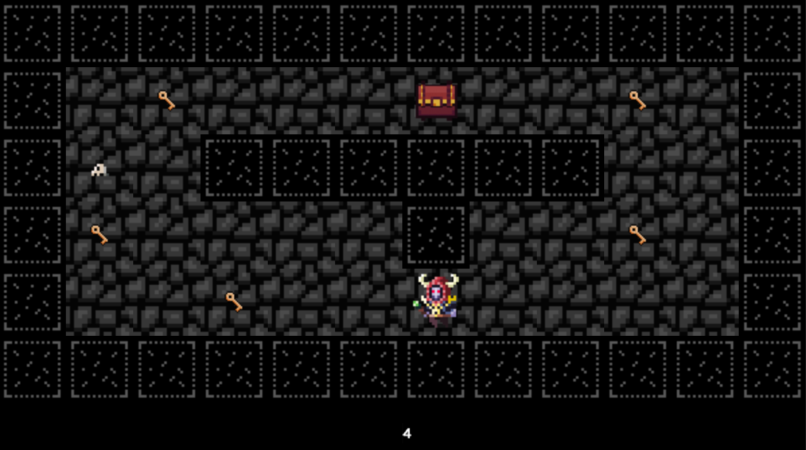

# so_long

Цель этого проекта — создать небольшую 2D-игру, в которой игроки должны собрать все предметы и выбраться из лабиринта, сделав как можно меньше ходов. Если героя настигает стражник - игра заканчивается.

Скрин игрового процесса.

Карта представляет собой файл ".ber" и загружается в качестве аргумента исполняемого файла.
